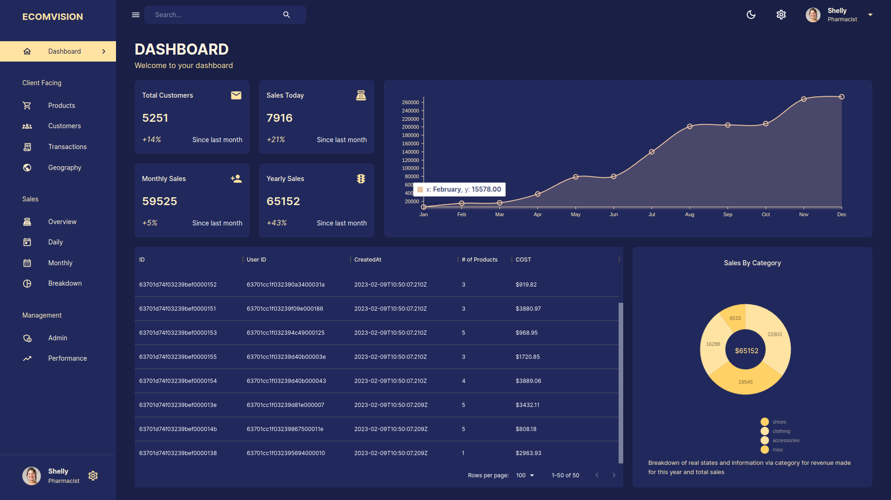

## ADMIN DASHBOARD

### Description :
This is the Back End for the full stack admin dashboard project. This admin dashboard helps admins to manage their team and get the related info filtered and organized. The front end is built using React, material UI, and Redux-toolkit. The backend has been built using Node, Express, and MongoDB. Authentication has been set up using Passport. Currently only super admin can login. Dark and light mode options has been made available. 

### Link to project: https://admin-dashboard-mernstack.netlify.app

### How It's Made:
Tech used: Node JS, Express JS, MongoDB.

User authentication has been implemented using Passport. Routes has been protected using a middleware.

### Optimizations
Api for adding new users could be added.

### Lessons Learned
Inserting user data and other sales related data in bulk was a new experience for me.

